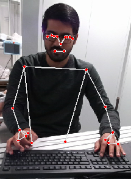

# MediaPipe ROS2 Pose Estimation

A ROS2 wrapper for Google's MediaPipe pose estimation library, providing real-time human pose detection and tracking.

## Overview

This project integrates MediaPipe's pose estimation capabilities with ROS2, enabling real-time detection and publishing of human pose landmarks. The system detects key body points and provides both 2D and 3D coordinates for various body parts including hands, arms, and facial features.



## Packages

- **mediapipe_msg**: Custom ROS2 message definitions for pose data
- **mediapipe_ros**: Core pose estimation node and MediaPipe integration
- **mediapipe_bringup**: Launch files and configuration

## Installation

1. Clone this repository into your ROS2 workspace:
```bash
cd ~/ros2_ws/src
git clone <your-repo-url>
```

2. Install dependencies:
```bash
rosdep install --from-paths src --ignore-src -r -y
```

3. Build the workspace:
```bash
colcon build
```

4. Source the setup file:
```bash
source install/setup.bash
```

## Usage

Launch the pose estimation system:
```bash
ros2 launch mediapipe_bringup pose.launch.py
```

## Message Format

The system publishes pose data in the following format:
- **Header**: Timestamp and frame information
- **Pose Array**: List of detected keypoints with:
  - Name (e.g., LEFT_WRIST, RIGHT_THUMB)
  - 2D coordinates (x, y in pixels)
  - 3D coordinates (x, y, z in millimeters)

## Dependencies

- ROS2 Humble
- MediaPipe
- OpenCV
- Python 3.10+
